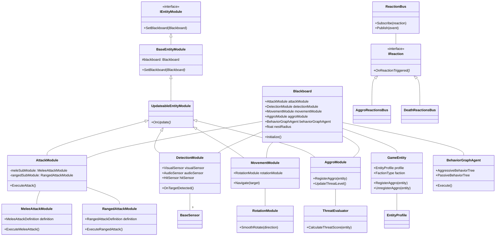
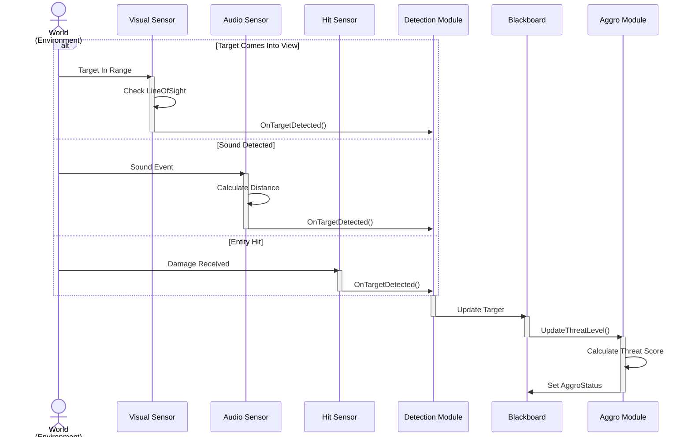
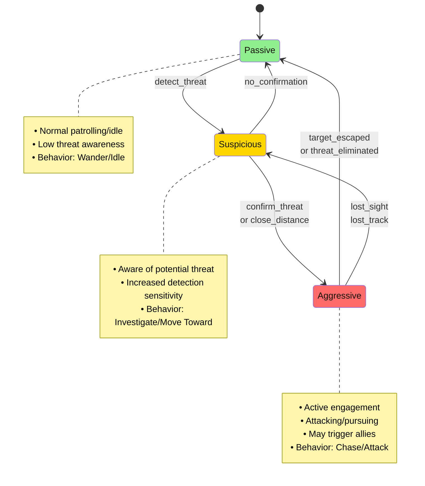
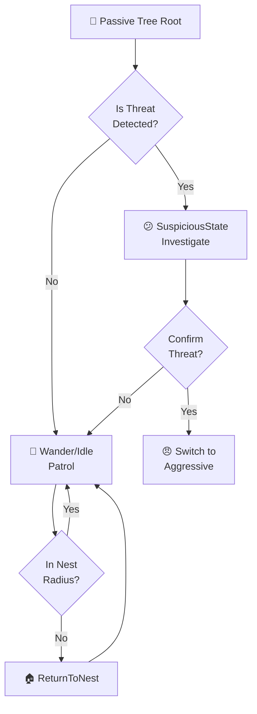
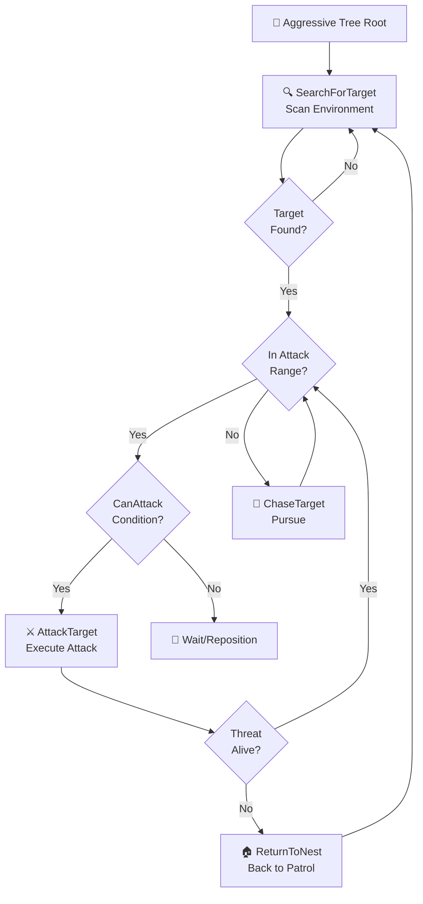
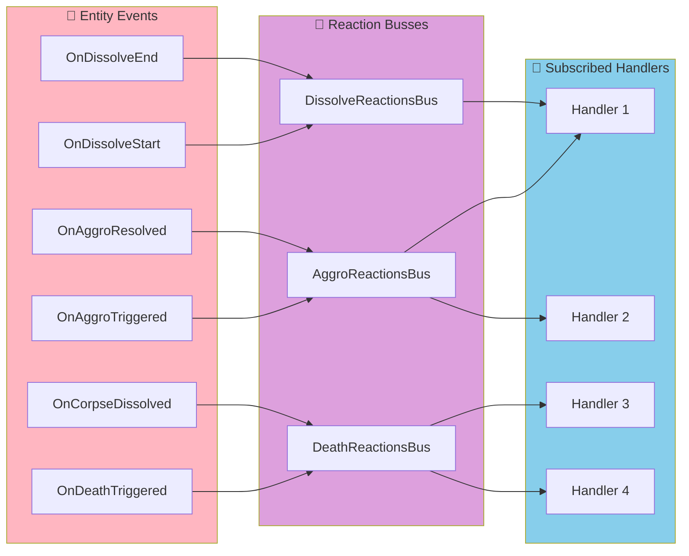
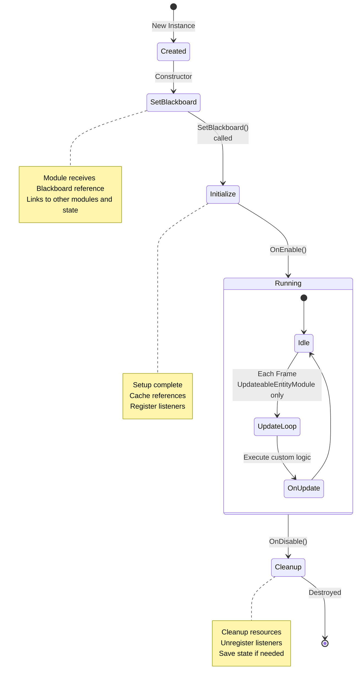

# Arch-AI: Advanced AI System for Game Entities

A robust, modular AI framework built for Unity that provides intelligent behavior, threat evaluation, detection systems, and combat mechanics for game entities. The system uses Behavior Trees combined with a modular architecture to create flexible and extensible AI behaviors.

## Table of Contents

- [Overview](#overview)
- [Architecture](#architecture)
- [Core Systems](#core-systems)
- [Module System](#module-system)
- [Behavior Trees](#behavior-trees)
- [Configuration](#configuration)
- [Getting Started](#getting-started)
- [Advanced Usage](#advanced-usage)

---

## Overview

Arch-AI is designed to power sophisticated AI agents in game environments with the following capabilities:

- **Intelligent Behavior Management**: Behavior Tree-based decision making with Passive, Suspicious, and Aggressive states
- **Advanced Detection System**: Multi-sensor detection (Visual, Audio, Hit-based) for awareness
- **Combat System**: Support for both melee and ranged attacks with customizable attack definitions
- **Movement & Navigation**: NavMesh-based pathfinding with smooth rotation and ground fitting
- **Threat Evaluation**: Dynamic threat assessment for intelligent threat prioritization
- **Reaction System**: Event-driven responses to aggro and death events
- **Modular Architecture**: Extensible component system with decoupled modules

---

## Architecture

### High-Level System Diagram: The "Body" of an AI Entity

```mermaid
graph TB
    subgraph Brain["🧠 BRAIN"]
        BT["Behavior Tree<br/>(Decision Making)<br/>Passive | Suspicious | Aggressive"]
    end
    
    subgraph Blackboard["🔗 BLACKBOARD - Central Nervous System"]
        BBtext["Shared State | Module References | Configuration"]
    end
    
    subgraph Organs["🫀 ORGANS (Action Modules)"]
        MM["🚶 Movement Module<br/>(Navigation + Rotation)<br/>NavMesh Agent | Ground Fitter"]
        AM["⚔️ Attack Module<br/>(Combat)<br/>Melee | Ranged"]
        ANM["🎬 Animator Module<br/>(Visual Feedback)"]
    end
    
    subgraph Senses["👁️ SENSES (Information Modules)"]
        DM["🔍 Detection Module<br/>(Visual | Audio | Hit)<br/>What can I see/hear/feel?"]
        TM["📊 Threat Evaluation<br/>(Threat Assessment)<br/>How dangerous is it?"]
        AGM["😠 Aggro Module<br/>(Emotional State)<br/>Am I angry/scared/calm?"]
    end
    
    subgraph Events["📢 REACTION SYSTEM"]
        ARB["Aggro Reactions Bus"]
        DRB["Death Reactions Bus"]
    end
    
    BT -->|Reads & Commands| Blackboard
    Blackboard -->|Provides State| BT
    
    Blackboard -->|Activates| MM
    Blackboard -->|Activates| AM
    Blackboard -->|Activates| ANM
    
    Blackboard -->|Reads Data| DM
    Blackboard -->|Reads Data| TM
    Blackboard -->|Reads Data| AGM
    
    MM -.->|Updates Position| Blackboard
    AM -.->|Reports Combat| Blackboard
    ANM -.->|Syncs Animation| Blackboard
    
    DM -.->|Target Detected| Blackboard
    TM -.->|Threat Level| Blackboard
    AGM -.->|Status Changed| Blackboard
    
    Blackboard -->|Triggers| ARB
    Blackboard -->|Triggers| DRB
    
    style Brain fill:#FFE4B5
    style Blackboard fill:#87CEEB
    style Organs fill:#90EE90
    style Senses fill:#FFB6C1
    style Events fill:#DDA0DD
```



### Class Hierarchy



---

## Core Systems

### 1. Blackboard System

The **Blackboard** is the central data hub that all modules communicate through. It acts as a shared memory space for AI state and configuration.

**Key Properties:**

```csharp
// Module References
public AttackModule attackModule;
public DetectionModule detectionModule;
public MovementModule movementModule;
public AggroModule aggroModule;
public AnimatorModule animatorModule;
public RotationModule rotationModule;

// Core Components
public GameEntity gameEntity;
public BehaviorGraphAgent behaviorGraphAgent;
public HealthComponent healthComponent;
public NavMeshAgent agent;
public Animator animator;

// Configuration
public float nestRadius = 40f;
public float idleTime = 3f;
```

**Initialization Flow:**
```
Blackboard.Initialize()
├── AttackModule.SetBlackboard()
├── DetectionModule.SetBlackboard()
├── MovementModule.SetBlackboard()
├── AggroModule.SetBlackboard()
├── RotationModule.Initialize()
├── AggroReactionsBus.Initialize()
└── DeathReactionsBus.Initialize()
```

### 2. Game Entity System

**GameEntity** represents an AI-controlled agent in the world with faction affiliation and aggro tracking.

**Key Features:**
- Faction-based team system
- Aggro entity registration/unregistration
- Access to health component
- Analytics integration

**Aggro Registration:**
```csharp
RegisterAggro(GameEntity entity)   // Track threat
UnregisterAggro(GameEntity entity) // Remove threat
```

### 3. Detection Module

Detects threats using three sensor types working in parallel:

| Sensor Type | Detection Method | Use Case |
|:---|:---|:---|
| **Visual Sensor (VisualSensor)** | Line-of-sight + field of view checks | Sight-based detection with obstruction |
| **Audio Sensor (AudioSensor)** | Distance-based sound detection | Hearing threats through obstacles |
| **Hit Sensor (HitSensor)** | Collision/damage callbacks | Immediate reaction to being attacked |

**Detection Pipeline:**


### 4. Attack Module

Supports multiple attack types with specialized sub-modules:

**Architecture:**
```
AttackModule (Master)
├── MeleeAttackModule
│   ├── Melee Range Detection
│   ├── Animation Triggers
│   └── Damage Application
└── RangedAttackModule
    ├── Projectile Spawning
    ├── Trajectory Calculation
    └── Hit Validation
```

**Attack Definitions:**
- `BaseAttackDefinition`: Abstract base class
- `MeleeAttackDefinition`: Close-range physical attacks
- `RangedAttackDefinition`: Projectile-based attacks

### 5. Movement Module

Integrates NavMesh pathfinding with smooth rotation and ground fitting:

**Components:**
- **NavigationAgent**: NavMesh pathfinding
- **RotationModule**: Smooth entity rotation
- **MovementProfile**: Configurable speed/acceleration
- **AIGroundFitter**: Keeps entity grounded

**Movement States:**
```
Idle (nestRadius) → Wander → Chase Target → Flee → Return Home
```

### 6. Aggro & Threat System

**Aggro Status Levels:**

```
┌─────────────────────────────────────────┐
│          AGGRO STATUS STATES             │
├─────────────────────────────────────────┤
│                                         │
│  ① PASSIVE                              │
│    └─ Normal patrolling/idle           │
│    └─ Low threat awareness             │
│                                         │
│          detect threat                  │
│             ▼                           │
│  ② SUSPICIOUS                          │
│    └─ Aware of potential threat        │
│    └─ Increased detection sensitivity  │
│    └─ Moves toward threat location     │
│                                         │
│       confirm/close distance            │
│             ▼                           │
│  ③ AGGRESSIVE                          │
│    └─ Active engagement                │
│    └─ Attacking/pursuing               │
│    └─ May trigger allies               │
│                                         │
│       threat eliminated/escaped        │
│             ▼                           │
│    Back to PASSIVE (cooldown)          │
│                                         │
└─────────────────────────────────────────┘
```



**Threat Evaluation System:**

The ThreatEvaluator calculates dynamic threat scores based on:
- Distance to threat
- Threat health percentage
- Faction relationship
- Recent damage taken
- Environmental factors

---

## Behavior Trees

### Tree Structure

The system uses Unity Behavior Graph agents with two primary behavior trees:

#### Passive Behavior Tree
Used for non-hostile entities with cautious behavior:


#### Aggressive Behavior Tree
Used for hostile entities with attack focus:


### Available Actions

| Action | Description | State |
|:---|:---|:---|
| `SearchForTargetAction` | Patrol and scan for threats | All |
| `TargetDetectionAction` | Update target information | Detection |
| `ChaseTargetAction` | Move toward target | Suspicious/Aggressive |
| `AttackToTargetAction` | Execute attack routine | Aggressive |
| `FleeFromTargetAction` | Run away from threat | Fear |
| `ReturnToNestAction` | Navigate back to home | Passive |
| `WanderAction` | Idle movement | Passive |
| `SetSpeedAction` | Adjust movement speed | Movement |

### Available Conditions

| Condition | Purpose |
|:---|:---|
| `CheckTargetCondition` | Is there a valid target? |
| `CanAttackCondition` | Is target in range? |
| `IsAliveCondition` | Is entity alive? |
| `IsOutOfNestCondition` | Is entity outside nest? |

---

## Reaction System

Event-driven response system using bus pattern for decoupled event handling:

```
Entity Action Occurs
    ▼
┌─────────────────────────┐
│   Event Bus Router      │
├─────────────────────────┤
│ ┌─────────────────────┐ │
│ │ AggroReactionsBus   │ │
│ │ - OnAggroTriggered  │ │
│ │ - OnAggroResolved   │ │
│ └─────────────────────┘ │
│                         │
│ ┌─────────────────────┐ │
│ │ DeathReactionsBus   │ │
│ │ - OnDeathTriggered  │ │
│ │ - OnCorpseDissolved │ │
│ └─────────────────────┘ │
│                         │
│ ┌─────────────────────┐ │
│ │ DissolveReactionsBus│ │
│ │ - OnDissolveStart   │ │
│ │ - OnDissolveEnd     │ │
│ └─────────────────────┘ │
└─────────────────────────┘
    ▼
Subscribed Handlers Execute
```



---

## Configuration

### Entity Profile

Each AI entity uses an `EntityProfile` asset containing:

```csharp
public class EntityProfile : ScriptableObject
{
    public string entityName;
    public int level;
    public float health;
    // ... other stats
}
```

### Movement Profile

Located in `Movement Module/Movement Data/`, defines movement capabilities:

```csharp
public class MovementProfile : ScriptableObject
{
    public float maxSpeed;
    public float acceleration;
    public float stoppingDistance;
    public float rotationSpeed;
}
```

### Threat Evaluation Settings

`Threat Evaluation/Threat Evaluation Settings.asset` contains threat calculation weights:

```csharp
public class ThreatEvaluationSettings : ScriptableObject
{
    public float distanceWeight;
    public float healthWeight;
    public float factionWeight;
    public float recentDamageWeight;
}
```

### Blackboard Configuration

Directly in inspector or code:

```csharp
blackboard.nestRadius = 40f;      // Nest detection radius
blackboard.idleTime = 3f;         // Idle behavior duration
```

---

## Getting Started

### Prerequisites

- Unity 2022.1+
- Unity Behavior Graph package
- Odin Inspector (optional, used for inspector UI)
- NavMesh configured in scene

### Setup Steps

1. **Create Entity Prefab**
   ```
   - Add GameObject with required components:
     - GameEntity script
     - Blackboard script
     - Animator
     - NavMeshAgent
     - HealthComponent
   ```

2. **Configure Modules**
   ```
   - Assign module instances to Blackboard references
   - Set up detection sensors
   - Configure attack modules
   ```

3. **Assign Behavior Tree**
   ```
   - Select appropriate behavior tree (Aggressive/Passive)
   - Assign to BehaviorGraphAgent component
   ```

4. **Link EntityProfile**
   ```
   - Create EntityProfile asset
   - Assign to GameEntity's entityProfile field
   ```

5. **Initialize System**
   ```csharp
   blackboard.Initialize();
   ```

---

## Advanced Usage

### Custom Actions

Create custom behavior tree actions by extending:

```csharp
using Unity.Behavior;

[BehaviorTreeNode(EXPECTED_VERSION = "1.0", GENERATED = true)]
public class CustomAction : Action
{
    private Blackboard blackboard;

    public override void OnStart()
    {
        blackboard = GetBlackboardVariable<Blackboard>();
    }

    public override Status Update() => Status.Success;

    public override void OnEnd() { }
}
```

### Custom Conditions

Extend condition system:

```csharp
using Unity.Behavior;

[BehaviorTreeNode(EXPECTED_VERSION = "1.0", GENERATED = true)]
public class CustomCondition : Condition
{
    private Blackboard blackboard;

    public override void OnStart()
    {
        blackboard = GetBlackboardVariable<Blackboard>();
    }

    public override bool IsTrue() => /* your logic */;
}
```

### Custom Sensors

Add new detection types:

```csharp
public class CustomSensor : BaseSensor
{
    public override void OnSensorUpdate()
    {
        // Detection logic
        OnTargetDetected(target);
    }
}
```

### Custom Modules

Implement module interface:

```csharp
public class CustomModule : UpdateableEntityModule
{
    public override void SetBlackboard(Blackboard blackboard)
    {
        base.SetBlackboard(blackboard);
    }

    public override void OnUpdate()
    {
        // Custom logic
    }
}
```

---

## Module Implementation Guide

### Module Lifecycle



---

## Performance Considerations

- **Modular Updates**: Only UpdateableEntityModule types update per-frame
- **Sensor Optimization**: Sensors use caching and distance checks
- **NavMesh Complexity**: Keep NavMesh density appropriate to entity count
- **Behavior Tree Depth**: Keep trees shallow (3-4 levels) for optimal performance

---

## File Structure Reference

```
Assets/AI System/
├── Behavior/
│   ├── Actions/           # Action implementations
│   ├── Conditions/        # Condition implementations
│   ├── Behavior Trees/    # Serialized tree assets
│   └── Enums/            # Shared enumerations
├── Modules/
│   ├── Core/             # Entity & module base classes
│   ├── Attack Module/    # Melee & ranged attacks
│   ├── Detection Module/ # All sensor types
│   ├── Movement Module/  # Navigation & rotation
│   ├── Aggro Module/     # Threat tracking
│   └── Threat Evaluation/# Threat calculation
├── Entities/
│   ├── Prefabs/          # Entity prefab variants
│   ├── Profiles/         # Configuration assets
│   └── Corpses/          # Death state prefabs
├── Nests/                # Home base system
├── Reactions/            # Event handler system
└── Utils/                # Utility functions
```

---

## Troubleshooting

| Issue | Solution |
|:---|:---|
| Entity not detecting targets | Check sensor configuration and LineOfSight |
| NavMesh not working | Ensure NavMesh is baked and agent fits |
| Behavior tree not executing | Verify BehaviorGraphAgent is enabled |
| Attack not landing | Check attack range and target position |
| Slow performance | Profile with Profiler, reduce entity count |

---

## Contributing

When extending Arch-AI:
1. Follow modular design patterns
2. Implement proper interfaces (IEntityModule, ISensor, etc.)
3. Use Blackboard for inter-module communication
4. Add corresponding behavior tree nodes
5. Test with multiple entity instances

---

## License

This project is part of the Archzeka game framework.

---

**Last Updated:** February 2026  
**Version:** 1.0